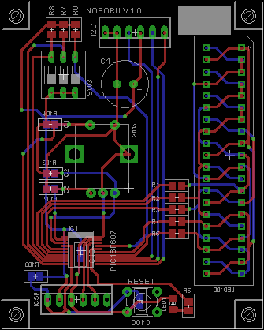

###Noboru

I2C Display- and input board with bargraph display and rotary encoder.

Can work autonomously or remote controlled. I2C Interface .

[Schematic](Images/Noboru.sch.png)

Made with CadSoft Eagle

###Tools

PIC16F687 MCU

Microchip MPLAB 7

CCS-PICC C-Compiler

###License

[BSD](LICENSE-BSD.txt) for software

[Creative Commons 4.0](LICENSE-CC.txt) for pcb and other artwork

###Copyright

Copyright (c) 2016 Bjoern Seip

